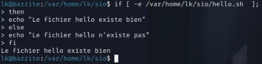
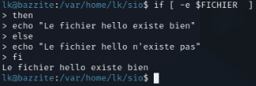

# Documentation : Scripting en Bash

---

# 0.

Ce guide présente les bases fondamentales pour créer des scripts d'automatisation sous Linux.

## 1. Structure d'un script
Tout script Bash doit commencer par le **Shebang**. Cette ligne indique au système que le fichier doit être interprété par Bash.

```bash
#!/bin/bash

# Ceci est un commentaire
echo "Vous êtes en BTS SIO"
```

### Exécution
Pour qu'un script puisse être lancé, il doit posséder les droits d'exécution :

```bash
# Donner les droits
chmod +x mon_script.sh

# Lancer le script
./mon_script.sh
```

!!! tip "Astuce"
    Utilisez l'extension `.sh` pour identifier vos scripts, bien que ce ne soit pas obligatoire sous Linux.

## 2. Variables et Entrées
En Bash, la gestion des espaces est cruciale : **aucun espace** autour du signe `=` lors de l'assignation.

```bash
#!/bin/bash

# Déclaration
NOM="Loris"
echo "Vous êtes en BTS SIO, $NOM"

# Lecture d'une entrée utilisateur
echo "Quel âge as-tu ?"
read AGE
echo "Tu as ${AGE}ans."
```


## 3. Les Conditions
Les conditions s'écrivent entre crochets `[ ]`. **Attention :** les espaces après `[` et avant `]` sont obligatoires.

ex:1


ex:2


### Comparateurs numériques
| Opérateur | Signification |
| :--- | :--- |
| `-eq` | Égal à (Equal) |
| `-ne` | Différent de (Not equal) |
| `-gt` | Plus grand que (Greater than) |
| `-lt` | Plus petit que (Less than) |
| `-ge` | Supérieur ou égal |
| `-le` | Inférieur ou égal |


### Exemple
```bash
if [ $AGE -ge 18 ]; then
    echo "Accès autorisé : vous êtes majeur."
else
    echo "Accès refusé : vous êtes mineur."
fi
```


## 4. Les Boucles
Les boucles permettent de répéter des tâches sur des listes de fichiers ou des plages de nombres.

### Boucle For
```bash
# Boucle sur une plage de nombres
for i in 10 11 12 13
do
eho "Chiffre : $CHIFFRES"
done
```


### Boucle While
```bash
COMPTEUR=1
while [ $COMPTEUR -le 3 ]; do
    echo "Compte : $COMPTEUR"
    ((COMPTEUR++))
done
```

## 5. Gestion des Arguments
Vous pouvez passer des paramètres à votre script lors de son appel : `./script.sh arg1 arg2`.

| Variable | Description |
| :--- | :--- |
| `$0` | Nom du script |
| `$1` à `$9` | Premier, deuxième argument, etc. |
| `$#` | Nombre total d'arguments passés |
| `$@` | Liste complète des arguments |
| `$?` | Code de retour de la dernière commande (0 = succès) |

## 6. Exemple complet : Backup automatique
Voici un script récapitulatif pour sauvegarder un dossier.

```bash
#!/bin/bash

SOURCE="/home/user/documents"
DESTINATION="/home/user/backups"
DATE=$(date +%Y-%m-%d)

# Vérification de l'existence du dossier source
if [ -d "$SOURCE" ]; then
    echo "--- Début de la sauvegarde ---"
    tar -czf "$DESTINATION/backup_$DATE.tar.gz" "$SOURCE"
    
    if [ $? -eq 0 ]; then
        echo "Succès : Fichier sauvegardé dans $DESTINATION"
    else
        echo "Erreur : La compression a échoué"
    fi
else
    echo "Erreur : Le dossier source n'existe pas."
    exit 1
fi
```

---

## 7. Les Variables de Position (Arguments)

Les variables de position sont des variables spéciales créées automatiquement par Bash dès que tu passes des arguments à ton script lors de son exécution.

### Les variables clés

| Variable | Rôle |
| :--- | :--- |
| **`$0`** | Le nom du script lui-même. |
| **`$1`** | Le **premier** argument passé. |
| **`$2`** | Le **deuxième** argument passé (et ainsi de suite jusqu'à `$9`). |
| **`${10}`** | Le dixième argument (les accolades sont obligatoires après 9). |
| **`$#`** | Le **nombre total** d'arguments fournis. |
| **`$@`** | La liste de **tous** les arguments (traités comme des mots séparés). |
| **`$?`** | Le code de retour de la dernière commande (0 = succès). |

### Exemple d'utilisation
Imaginons un script nommé `config_user.sh` :

```bash
#!/bin/bash

# Vérifier si on a assez d'arguments
if [ $# -lt 2 ]; then
    echo "Usage: $0 <prenom> <nom>"
    exit 1
fi

echo "Nom du script : $0"
echo "Traitement de l'utilisateur : $1 $2"
echo "Nombre total d'arguments : $#"
```

**Appel du script :**
```bash
./config_user.sh Jean Dupont
```

### La commande `shift`
La commande `shift` est une astuce souvent utilisée dans les scripts complexes. Elle permet de "décaler" les arguments vers la gauche : `$2` devient `$1`, `$3` devient `$2`, etc. C'est très utile pour traiter le premier argument puis boucler sur le reste.

```bash
#!/bin/bash
echo "Premier argument : $1"
shift
echo "L'ancien deuxième argument est maintenant le premier : $1"
```

!!! info "Le saviez-vous ?"
    La variable **`$@`** est généralement préférée à **`$*`**. Pourquoi ? Parce que `"$@"` protège les arguments contenant des espaces, les gardant bien séparés, alors que `"$*"` les fusionne en une seule grande chaîne de caractères.

---

Souhaites-tu que l'on aborde la gestion des **tableaux** ou la création de **fonctions** pour organiser ton code ?