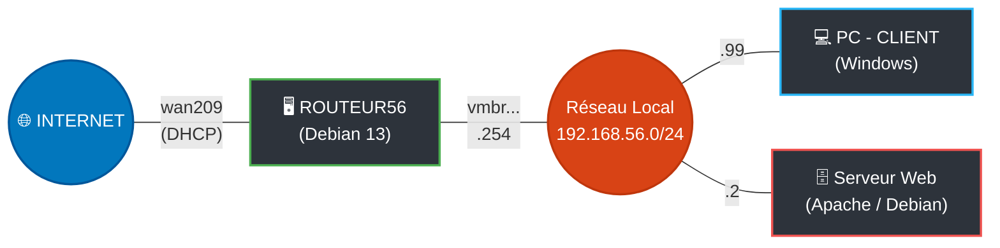
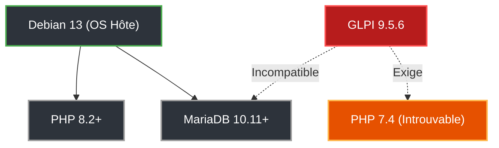
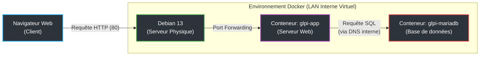

# Documentation : Installation GLPI 9.5.6 sur Debian 13

**Auteur :** Loris.R   
**Module :** B2  
**Sujet :** Configuration Serveur GLPI 9.5.6 sur Debian 13

---

!!! abstract "Introduction : Environnement et Objectifs"
    Pour réaliser ce TP, l'objectif était d'installer la version spécifique GLPI 9.5.6 sur un serveur fraîchement installé sous Debian 13. Ce document retrace l'intégralité du processus de réflexion, les obstacles liés à l'obsolescence logicielle, et la transition vers une architecture moderne par conteneurisation pour résoudre ces conflits.

---

## Topologie Réseau

Le schéma ci-dessous illustre l'architecture réseau mise en place entre les différentes machines virtuelles de l'environnement :



---

## Tentative d'installation native

Initialement, La démarche consistait à installer les paquets nativement sur l'OS (Apache2, MariaDB, PHP). Cependant, la première exécution du script d'installation web de GLPI a retourné une erreur bloquante à l'étape 3 (Initialisation de la base de données).

### Le problème de syntaxe MariaDB

!!! failure "Erreur affichée par l'installateur GLPI"
    `You have an error in your SQL syntax; check the manual... near '0', type int(11)`

Cette erreur s'explique par un fossé générationnel entre GLPI 9.5.6 (sorti vers 2021) et la version de MariaDB intégrée à Debian 13 (version 10.11+) :

* Le terme `TYPE=InnoDB` utilisé dans les anciens scripts SQL de GLPI a été définitivement supprimé des versions récentes de MariaDB (remplacé par `ENGINE=InnoDB`).
* Le mot `type` est devenu un mot réservé strict, et la précision de longueur `int(11)` est désormais considérée comme obsolète, ce qui déclenche une erreur si le serveur est en mode "strict".

### Contournement SQL

Pour forcer l'installation, j'ai exécuté plusieurs commandes de modification directe :

```bash
sed -i 's/TYPE=InnoDB/ENGINE=InnoDB/g' /var/www/html/glpi/install/mysql/*.sql
```
* **Effet :** Cette commande lit tous les fichiers d'installation SQL de GLPI et remplace l'ancienne syntaxe `TYPE` par la nouvelle `ENGINE`.

Ensuite, pour forcer MariaDB à accepter des requêtes mal formatées, le comportement du serveur SQL a été altéré :

```sql
SET GLOBAL sql_mode = '';
SET GLOBAL innodb_strict_mode = OFF;
```
* **Effet :** Baisse temporairement la sécurité et la rigueur de MariaDB pour qu'il ignore les erreurs liées aux mots réservés.

!!! warning "Résultat de l'approche native"
    Cependant, malgré ces ajustements et le remplacement des fichiers SQL, l'architecture native PHP/MariaDB continuait de générer des requêtes corrompues à la volée, rendant l'installation impossible.

---

## Le mur des dépendances

Face aux échecs SQL, le problème racine a été identifié : **GLPI 9.5.6 exige impérativement PHP 7.4** pour fonctionner correctement, or Debian 13 fournit nativement PHP 8.2+.

### L'obsolescence de PHP 7.4

J'ai dû tenter d'importer PHP 7.4 via un dépôt externe (le dépôt officiel Sury).

```bash
echo "deb [https://packages.sury.org/php/](https://packages.sury.org/php/) bookworm main" > /etc/apt/sources.list.d/php.list
apt update
apt install php7.4
```
* **Effet :** Demande au gestionnaire de paquets (`apt`) de télécharger une ancienne version de PHP compilée pour la version précédente de Debian.

!!! danger "Erreur critique du gestionnaire de paquets"
    Cette tentative s'est soldée par une erreur critique d'apt :  
    `Impossible de satisfaire les dépendances : php7.4-intl : Dépend: libicu72 mais il n'est pas installable`
    
    **Pourquoi cela a échoué :** Debian 13 utilise des bibliothèques systèmes (les fondations de l'OS) très récentes. PHP 7.4 cherche des composants anciens (comme `libldap-2.5-0`) qui n'existent plus. Forcer l'installation aurait cassé le noyau du système d'exploitation. **L'installation native m'était donc matériellement impossible.**



---

## Solution de conteneurisation

Pour exécuter un logiciel obsolète sur un système ultra-récent, la seule solution viable a été d'isoler l'application.

### Pourquoi utiliser Docker ?

Contrairement à une machine virtuelle complète qui est lourde et consomme beaucoup de RAM, un conteneur est une "bulle" légère qui s'exécute sur l'OS hôte, mais qui possède ses propres dépendances internes. 

**Avantage principal :** Docker permet de télécharger un environnement pré-packagé contenant un vieux Linux virtuel avec exactement PHP 7.4 et MariaDB 10.5, sans jamais interférer avec le système Debian 13 de base.

### Nettoyage et installation de Docker

Avant de déployer Docker, il a fallu libérer les ports réseau (80 pour le web, 3306 pour SQL) utilisés par l'installation native ratée :

```bash
systemctl stop apache2 mariadb
apt purge -y apache2 mariadb-server "php*"
apt autoremove -y
```
* **Effet :** Supprime complètement Apache, MariaDB, PHP et leurs dépendances orphelines, rendant le serveur à nouveau "propre".

Ensuite, l'environnement Docker a été installé et activé :

```bash
apt install -y docker.io docker-compose
systemctl enable --now docker
```
* **Effet :** `docker.io` est le moteur (le service d'arrière-plan qui gère les conteneurs). `docker-compose` est l'outil qui permet de lancer plusieurs conteneurs en même temps. La commande `systemctl enable --now` assure que le service démarre immédiatement et se relancera à chaque redémarrage.

---

## Configuration du Docker Compose

### L'Infrastructure as Code

Au lieu de taper de longues commandes complexes dans le terminal pour créer les conteneurs, Docker Compose permet de définir toute l'infrastructure dans un seul fichier texte lisible : `docker-compose.yml`.

### Décorticage du fichier docker-compose.yml

Voici l'explication ligne par ligne de la configuration déployée :

```yaml
services:
```
> *Déclare le début de la liste des "machines" virtuelles. Il y en a deux : mariadb et glpi.*

```yaml
  mariadb:
    image: mariadb:10.5
    container_name: glpi-mariadb
```
> * **image :** Demande à Docker de télécharger la version exacte 10.5 de MariaDB depuis le Docker Hub. C'est la version idéale pour GLPI 9.5.
> * **container_name :** Attribue un nom lisible à la bulle pour faciliter sa gestion future.

```yaml
    environment:
      - MARIADB_ROOT_PASSWORD=Secr3tRootPassword!
      - MARIADB_DATABASE=glpi
      - MARIADB_USER=glpi_user
      - MARIADB_PASSWORD=glpi2026
```
> * **environment :** C'est ici que sont injectées les variables lors du tout premier démarrage. MariaDB lira ces paramètres et créera automatiquement la base `glpi` et l'utilisateur associé, évitant ainsi de le faire à la main en ligne de commande SQL.

```yaml
    volumes:
      - ./mysql_data:/var/lib/mysql
    restart: always
```
> * **volumes :** C'est la persistance des données. Un conteneur est amnésique. Cette ligne crée un pont entre le dossier réel `./mysql_data` sur le serveur Debian 13 et le dossier virtuel `/var/lib/mysql` dans le conteneur. Les données sont ainsi sauvegardées sur le disque physique.
> * **restart :** Si le serveur redémarre ou plante, Docker le relancera automatiquement.

```yaml
  glpi:
    image: diouxx/glpi:php7.4
    container_name: glpi-app
    ports:
      - "80:80"
```
> * **image :** L'image communautaire `diouxx/glpi` est utilisée, avec le tag explicite `php7.4`.
> * **ports :** Mécanisme de redirection réseau (expliqué en détail dans la section sur la redirection de ports).

```yaml
    environment:
      - TIMEZONE=Europe/Paris
      - VERSION_GLPI=9.5.6
```
> * **VERSION_GLPI=9.5.6 :** Le créateur de cette image a inclus un script intelligent. Au lieu d'avoir une image Docker pour chaque micro-version, l'image télécharge et décompresse dynamiquement la version demandée dans cette variable au moment du démarrage.

```yaml
    volumes:
      - ./glpi_data:/var/www/html/glpi
    depends_on:
      - mariadb
```
> * **depends_on :** Force le serveur web à attendre que le conteneur `mariadb` soit complètement allumé avant de démarrer lui-même, évitant ainsi une erreur de connexion à la base.

---

## Le piège du moteur PHP

Lors du premier lancement du conteneur avec l'image `diouxx/glpi:latest`, l'installation a planté de nouveau avec une erreur SQL très similaire aux premiers essais (`near ''0'`).

### Erreur d'injection SQL

Le problème venait du tag `:latest` que j'avais initialement utilisé dans le fichier compose pour l'image GLPI. Le conteneur téléchargeait la dernière version de son propre système, embarquant PHP 8.3. 

!!! bug "Le changement de comportement de PHP"
    Depuis PHP 8.1, la fonction interne de traitement de texte `htmlentities()` a changé de comportement. Lorsqu'elle lit le script d'installation de GLPI 9.5.6, elle transforme involontairement les guillemets simples en code HTML, ce qui corrompt la requête avant même qu'elle ne soit envoyée à la base de données.

### Conteneur basé sur Debian 12

C'est pourquoi, dans la configuration finale, j'ai spécifié l'image `diouxx/glpi:php7.4`. La particularité de cette image spécifique est qu'elle contient une architecture logicielle basée sur **Debian 12 (Bookworm)**. 

!!! tip "La magie de l'isolation"
    Le serveur hôte tourne sous un OS ultra-récent (Debian 13), mais à l'intérieur de sa bulle isolée, le conteneur fait tourner son propre sous-système Debian 12. Cela a permis au créateur de l'image de fournir proprement PHP 7.4 (qui n'existe plus sous Debian 13) avec toutes ses anciennes dépendances, sans jamais interférer avec l'OS hôte.

### Exécution et test final

Le déploiement de l'infrastructure complète s'effectue en une seule commande :

```bash
docker-compose up -d
```
* **Effet :** Le paramètre `-d` (detached) exécute les processus en arrière-plan. Docker télécharge les deux OS virtuels, configure le réseau interne, initialise les mots de passe et télécharge la release 9.5.6 de GLPI.

L'installation web de GLPI a ensuite pu aboutir parfaitement, validant la pertinence de la conteneurisation.

---

## La redirection de ports

Une fois le conteneur démarré, l'application GLPI est instantanément accessible en tapant simplement l'adresse IP du serveur Debian physique dans un navigateur web. Tout repose sur la directive `ports` du fichier docker-compose.

### Le port HTTP par défaut

Lorsqu'un utilisateur saisit une adresse telle que `http://ip_du_serveur`, le préfixe `http://` indique implicitement au navigateur de se connecter au port web standard : le **port 80**. La requête arrive donc "à la porte numéro 80" du serveur physique Debian 13.

### Le mécanisme de Port Forwarding

Dans la configuration du service GLPI, la ligne suivante a été déclarée :
```yaml
    ports:
      - "80:80"
```
Cette syntaxe se lit de gauche à droite : `"Port_Physique_Hôte : Port_Interne_Conteneur"`.

* **Le 80 de gauche :** Il ordonne à Docker de se placer en écoute sur le port 80 de l'interface réseau du serveur Debian physique.
* **Le 80 de droite :** Il correspond au port d'écoute du serveur web interne (Apache) qui tourne à l'intérieur du conteneur sous Debian 12.

**Effet global :** Dès qu'une requête arrive sur le port 80 du serveur physique, le service réseau de Docker (qui agit comme un réceptionniste) intercepte cette requête. Il crée un tunnel réseau de manière transparente et la redirige instantanément vers le port 80 du conteneur.

!!! info "Exemple de fonctionnement alternatif"
    Si le port 80 du serveur Debian était déjà utilisé par un autre service, la configuration aurait pu être : `ports: - "8080:80"`.
    Dans ce cas, le serveur web du conteneur écouterait toujours sur son port 80 interne de manière identique, mais l'accès depuis l'extérieur nécessiterait de taper `http://ip_du_serveur:8080`.

---

## Architecture multi-conteneurs

L'analyse du fichier `docker-compose.yml` révèle, sous la balise `services:`, la présence de deux blocs de configuration distincts (`mariadb:` et `glpi:`). L'infrastructure déployée ne repose donc pas sur une seule machine, mais sur **deux conteneurs distincts** travaillant en synergie.



### Deux rôles distincts

* **Le conteneur Base de données (`glpi-mariadb`) :** Sa fonction est strictement limitée à l'exécution du moteur MariaDB 10.5. Il ne contient aucun serveur web ou interpréteur PHP.
* **Le conteneur Application (`glpi-app`) :** Il agit exclusivement comme serveur web. Il fait tourner Apache, PHP 7.4 et héberge le code de GLPI, sans posséder de moteur de base de données en interne.

### Avantages de l'approche

Cette séparation respecte la règle d'or de la conteneurisation, qui offre trois avantages majeurs :

1. **Stabilité :** L'isolation des processus garantit que si le serveur web (Apache) rencontre une erreur fatale ou sature, la base de données n'est pas impactée et continue de fonctionner de manière autonome.
2. **Flexibilité et Évolutivité :** S'il devient nécessaire de passer à une version supérieure de MariaDB, il suffit de détruire et recréer uniquement le conteneur de base de données, sans altérer les fichiers web.
3. **Sécurité renforcée :** Le conteneur `mariadb` ne possède aucune directive `ports:` dans le fichier compose. Il est donc totalement invisible et inaccessible depuis l'extérieur. Seul le conteneur GLPI a l'autorisation technique de lui parler.

### Communication interne (DNS Docker)

Puisque les deux services sont séparés dans deux bulles différentes, ils doivent pouvoir communiquer. Lors du déploiement via la commande `docker-compose up -d`, Docker crée automatiquement un réseau virtuel privé exclusif à ces deux conteneurs.

Dans ce réseau isolé, le moteur Docker agit comme un véritable **serveur DNS interne**. Ainsi, lors de la configuration web finale de GLPI, il n'est pas nécessaire de renseigner une adresse IP complexe pour connecter l'application à la base de données. Le conteneur `glpi-app` peut joindre son voisin en utilisant simplement son nom de service défini dans le fichier YAML : **`mariadb`**. Docker se charge d'intercepter cette requête et de la résoudre en adresse IP interne de manière totalement transparente.

---

## Migration vers GLPI 10.0.15 en natif

!!! abstract "Objectif de la migration"
    Face aux limites de la version 9.5.6 (obsolescence logicielle, incompatibilité matérielle), le déploiement d'un **nouveau serveur** avec **GLPI 10.0.15** a été acté.

---

### 1. Préparation du système et dépôt SURY

Debian 13 intégrant nativement PHP 8.2, il est nécessaire d'ajouter le dépôt officiel **SURY** pour forcer l'installation de **PHP 8.3**, version optimale pour le fonctionnement de GLPI 10.

```bash
# 1. Mise à jour de base et prérequis réseau
apt update && apt upgrade -y
apt install -y lsb-release apt-transport-https ca-certificates curl wget

# 2. Ajout de la clé de sécurité et du dépôt SURY
curl -sSLo /usr/share/keyrings/deb.sury.org-php.gpg [https://packages.sury.org/php/apt.gpg](https://packages.sury.org/php/apt.gpg)
sh -c 'echo "deb [signed-by=/usr/share/keyrings/deb.sury.org-php.gpg] [https://packages.sury.org/php/](https://packages.sury.org/php/) $(lsb_release -sc) main" > /etc/apt/sources.list.d/php.list'

# 3. Rafraîchissement de la liste des paquets
apt update
```
* **Effet :** Autorise le gestionnaire APT à télécharger des paquets fiables depuis un serveur externe spécialisé dans le maintien des dernières versions de PHP.

### 2. Installation de la pile LAMP (Linux,Apache,MariaDB,PHP)

L'étape suivante consiste à installer le serveur web, le moteur de base de données, et l'interpréteur PHP accompagné de tous les modules requis par l'application.

```bash
# Installation des moteurs Web et SQL
apt install -y apache2 mariadb-server

# Installation de PHP 8.3 et de ses dépendances
apt install -y php8.3 php8.3-core php8.3-mysql php8.3-xml php8.3-cli php8.3-cas php8.3-bz2 php8.3-curl php8.3-mbstring php8.3-intl php8.3-gd php8.3-zip php8.3-ldap
```

**Détail des extensions PHP (`php8.3-*`) :** L'application requiert ces modules spécifiques pour manipuler des images (`gd`), décompresser des archives (`zip`, `bz2`), gérer les caractères internationaux (`intl`, `mbstring`) et permettre une future communication avec un annuaire Active Directory (`ldap`).

### 3. Configuration de MariaDB

Il est nécessaire de provisionner un espace de stockage pour GLPI.

Dans le terminal Debian, lancez l'invite de commande SQL via `mysql -u root` et exécutez les requêtes suivantes :

```sql
-- Création de la base de données (avec un encodage universel moderne)
CREATE DATABASE glpi_db CHARACTER SET utf8mb4 COLLATE utf8mb4_unicode_ci;

-- Création d'un utilisateur dédié (sans mot de passe)
CREATE USER 'glpi_user'@'localhost' IDENTIFIED BY 'Glpiglpi0';

-- Octroi de tous les privilèges à cet utilisateur sur la base GLPI
GRANT ALL PRIVILEGES ON glpi_db.* TO 'glpi_user'@'localhost';

```


### 4. Déploiement de GLPI 10.0.15

L'archive officielle est récupérée depuis GitHub et décompressée directement dans le répertoire d'hébergement du serveur web Apache.

```bash
# Se placer dans le répertoire racine web
cd /var/www/html/

# Téléchargement de l'archive
wget [https://github.com/glpi-project/glpi/releases/download/10.0.15/glpi-10.0.15.tgz](https://github.com/glpi-project/glpi/releases/download/10.0.15/glpi-10.0.15.tgz)

# Extraction (génère automatiquement le dossier /glpi)
tar -xvf glpi-10.0.15.tgz

# Nettoyage de l'archive téléchargée
rm glpi-10.0.15.tgz
```

### 5. Sécurisation des droits d'accès

Pour que le serveur web Apache puisse interagir avec les dossiers (upload de documents, mise à jour des plugins, génération de logs), l'utilisateur système qui fait tourner le processus web doit en devenir le propriétaire.

```bash
# Attribution du dossier GLPI à l'utilisateur système d'Apache (www-data)
chown -R www-data:www-data /var/www/html/glpi

# Sécurisation des permissions (Lecture/Exécution pour tous, Écriture pour le propriétaire)
chmod -R 755 /var/www/html/glpi
```

!!! success "Prêt pour la configuration graphique"
    L'infrastructure système est désormais totalement déployée et configurée. La suite de l'installation s'effectue via l'assistant web, accessible en tapant `http://[IP_DU_SERVEUR]/glpi` dans un navigateur. (En l'occurrence, depuis le 'PC Client' sous Windows)

### 6. Initialisation de Glpi

---

## Identifiants de connexion par défaut

Lors de l'installation initiale de GLPI, plusieurs comptes sont créés automatiquement avec des niveaux d'habilitation différents. Voici les identifiants à utiliser (Login / Mot de passe) :

* **Super-Administrateur :** `glpi` / `glpi`
* **Technicien :** `tech` / `tech`
* **Utilisateur normal :** `normal` / `normal`
* **Utilisateur "Post-only" (Création de tickets uniquement) :** `post-only` / `postonly`

!!! warning "Rappel de sécurité"
    Dès votre première connexion avec le compte `glpi`, il est impératif de modifier ces mots de passe ou de désactiver/supprimer les comptes dont vous n'aurez pas l'utilité. Tant que ces identifiants par défaut sont actifs sur le serveur, GLPI affichera un avertissement de sécurité orange persistant sur le tableau de bord !
