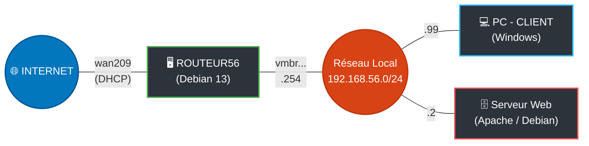

# Documentation : Installation My Tiny Todo

**Auteur :** Loris.R   
**Module :** B1  
**Sujet :** Installation My Tiny Todo

---
## Topologie Réseau

Le schéma ci-dessous illustre l'architecture réseau mise en place entre les différentes machines virtuelles de l'environnement :


---

### Installation de la pile LAMP (Linux,Apache,MariaDB,PHP)

La première étape consiste à installer le serveur web, le moteur de base de données, et l'interpréteur PHP accompagné des modules requis par l'application.

```bash
# Installation des moteurs Web et SQL
apt install -y apache2 mariadb-server

# Installation de PHP 8.3 et de ses dépendances allégées
apt install -y php8.3 php8.3-core php8.3-mysql php8.3-xml php8.3-cli php8.3-mbstring php8.3-intl

```

**Détail des extensions PHP (`php8.3-*`) :** Contrairement à de gros systèmes, myTinyTodo est très léger. L'application requiert uniquement ces modules de base pour communiquer avec la base de données (`mysql`) et gérer correctement les caractères spéciaux et internationaux (`mbstring`, `intl`).

### Configuration de MariaDB

Il est nécessaire de provisionner un espace de stockage pour myTinyTodo.

Dans le terminal Debian, lancez l'invite de commande SQL via `mysql -u root` et exécutez les requêtes suivantes :

```sql
-- Création de la base de données 
CREATE DATABASE db_mytinytodo CHARACTER SET utf8mb4 COLLATE utf8mb4_unicode_ci;

-- Création d'un utilisateur dédié 
CREATE USER 'admindb_todo'@'localhost' IDENTIFIED BY 'TodoTodo0!';

-- Octroi de tous les privilèges à cet utilisateur sur la base myTinyTodo
GRANT ALL PRIVILEGES ON db_mytinytodo.* TO 'admindb_todo'@'localhost';

-- Application des privilèges et sortie
FLUSH PRIVILEGES;
EXIT;

```

### Déploiement de myTinyTodo v1.8.3

L'archive officielle de la dernière version stable est récupérée depuis le dépôt GitHub officiel, puis décompressée dans le répertoire d'hébergement du serveur web Apache.

```bash
# Se placer dans le répertoire racine web
cd /var/www/html/

# Téléchargement de l'archive officielle
wget [https://github.com/maxpozdeev/mytinytodo/archive/refs/tags/v1.8.3.tar.gz](https://github.com/maxpozdeev/mytinytodo/archive/refs/tags/v1.8.3.tar.gz)

# Extraction
tar -xvf v1.8.3.tar.gz

# Renommer le dossier généré pour une URL plus propre
mv mytinytodo-1.8.3 mytinytodo

# Nettoyage de l'archive téléchargée
rm v1.8.3.tar.gz

```

### Configuration des droits d'accès

Pour que le serveur web Apache puisse interagir avec les dossiers (notamment pour écrire le fichier de configuration de la base de données ou gérer le mode SQLite de secours), l'utilisateur système web doit en devenir le propriétaire.

```bash
# Attribution du dossier myTinyTodo à l'utilisateur système d'Apache (www-data)
chown -R www-data:www-data /var/www/html/mytinytodo

```

!!! success "Prêt pour la configuration graphique"
L'infrastructure système est désormais totalement déployée et configurée. La suite de l'installation s'effectue via le script web initial, accessible en tapant `http://[IP_DU_SERVEUR]/mytinytodo/setup.php` dans un navigateur. (En l'occurrence, depuis le 'PC Client' sous Windows).

### Initialisation de myTinyTodo

Lors de l'accès à la page `setup.php`, le système demandera les informations de la base de données créées à l'étape 3 (`db_mytinytodo`, `admindb_todo`, etc.). Cliquez ensuite sur "Install" pour générer les tables SQL.

---

