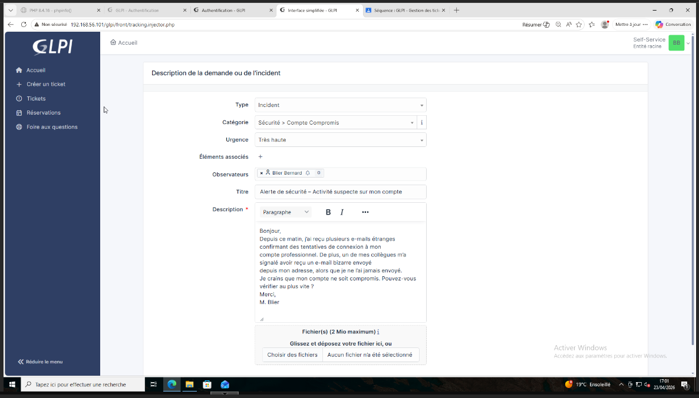
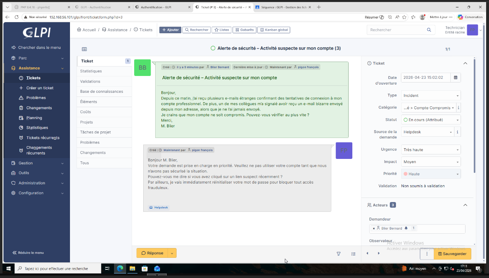
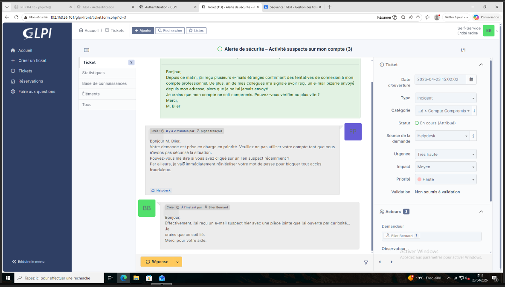
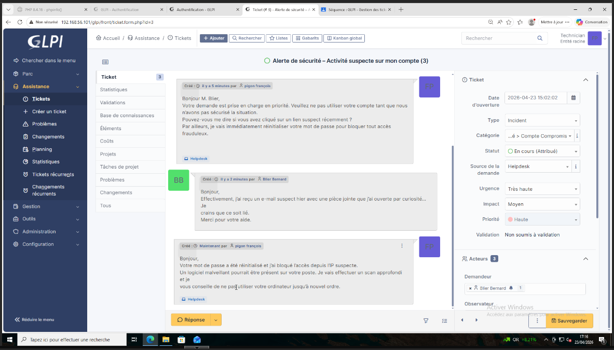
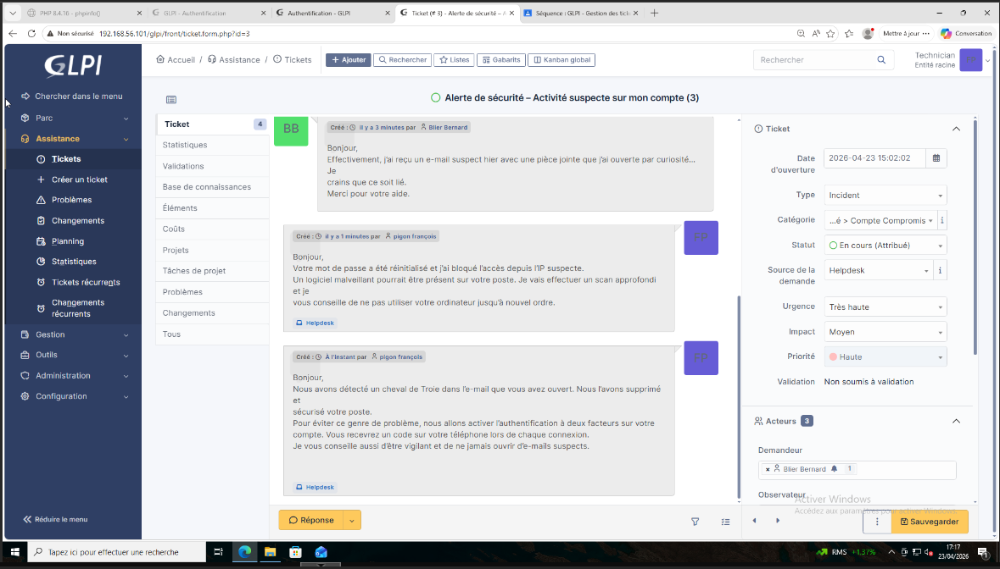
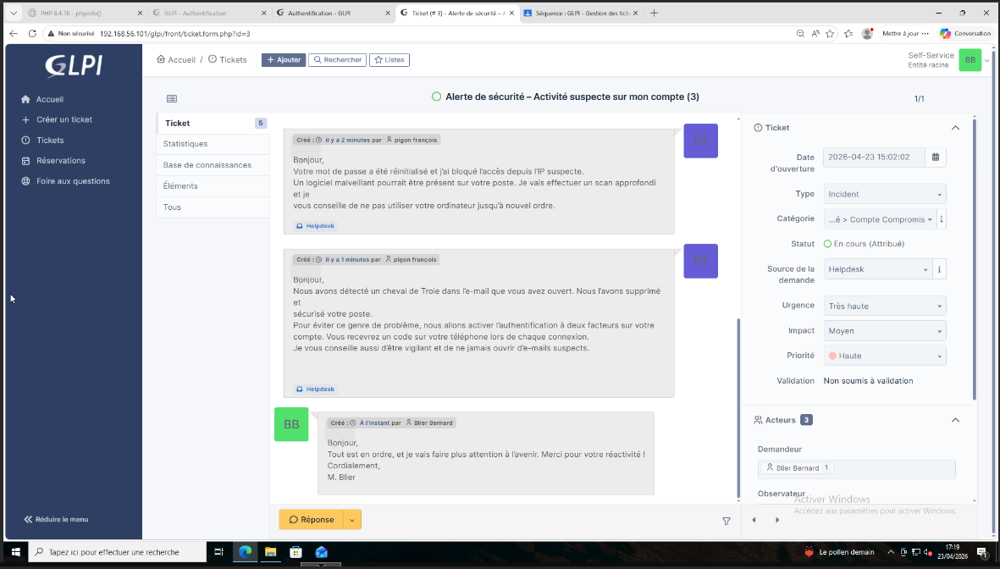
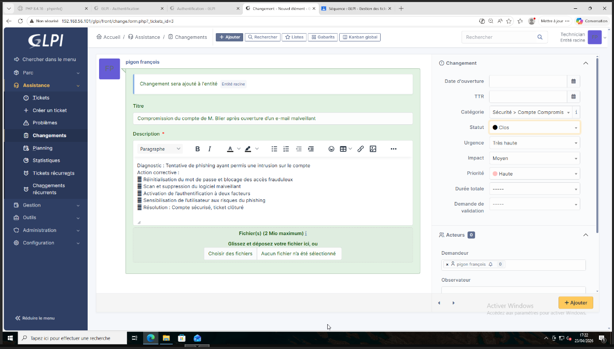

# Documentation : Utilisation-GLPI

**Auteur :** Loris.R   
**Module :** B2  
**Sujet :** Utilisation-GLPI

---

## Installation de plugins (Data Injection)

## Ajout de Catégories ITIL

---

## Création de Tickets : Situaton 1

---

## Création de Tickets : Situaton 2

