# Documentation : Utilisation-GLPI

**Auteur :** Loris.R  
**Module :** B2  
**Sujet :** Utilisation-GLPI

---

## Installation de plugins (Data Injection)

*(à documenter)*

## Ajout de Catégories ITIL

*(à documenter)*

---

## Création de Tickets : Situation 1 (Problème Réseau)

!!! abstract "Contexte de l'incident"
    L'utilisateur (M. Blier) rencontre une perte d'accès à Internet depuis son poste de travail situé au Bureau 2B[cite: 1]. La priorité est définie sur "Normale" et la catégorie ITIL concernée est "Réseau > Connexion Internet"[cite: 1].

### 1. Création et Prise en charge

[cite_start]L'utilisateur ouvre un ticket indiquant que malgré un redémarrage de sa machine et la vérification du branchement de son câble, la connexion est impossible[cite: 1].

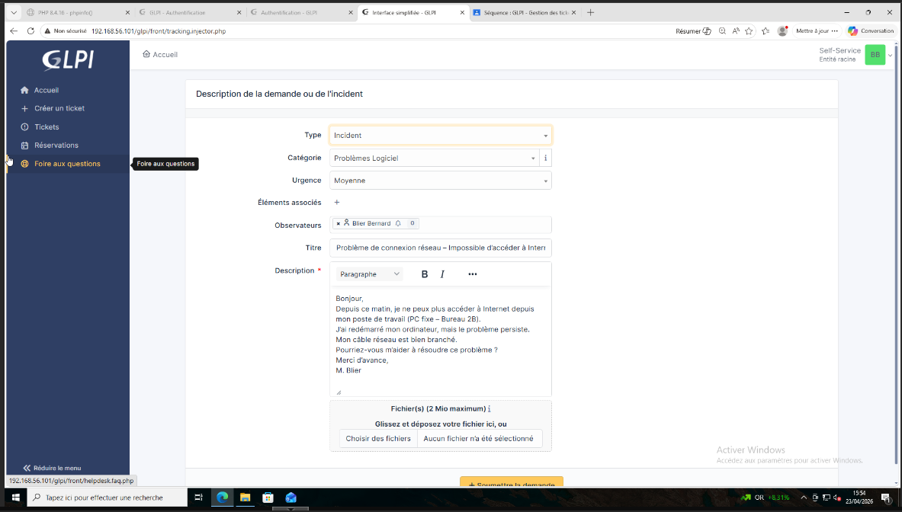

[cite_start]Le technicien (M. Pignon) s'assigne le ticket et interroge l'utilisateur pour savoir si d'autres collègues dans le même bureau sont impactés par cette panne[cite: 1].

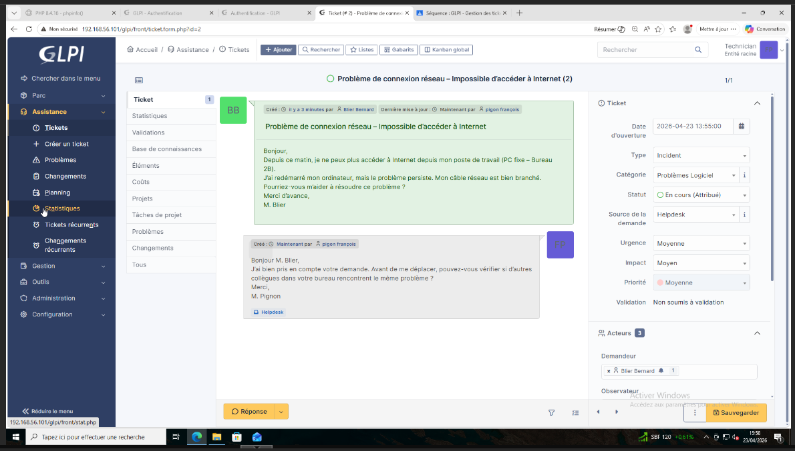

[cite_start]M. Blier confirme dans le suivi du ticket qu'il est le seul concerné et que ses collègues ont bien accès à Internet[cite: 1].

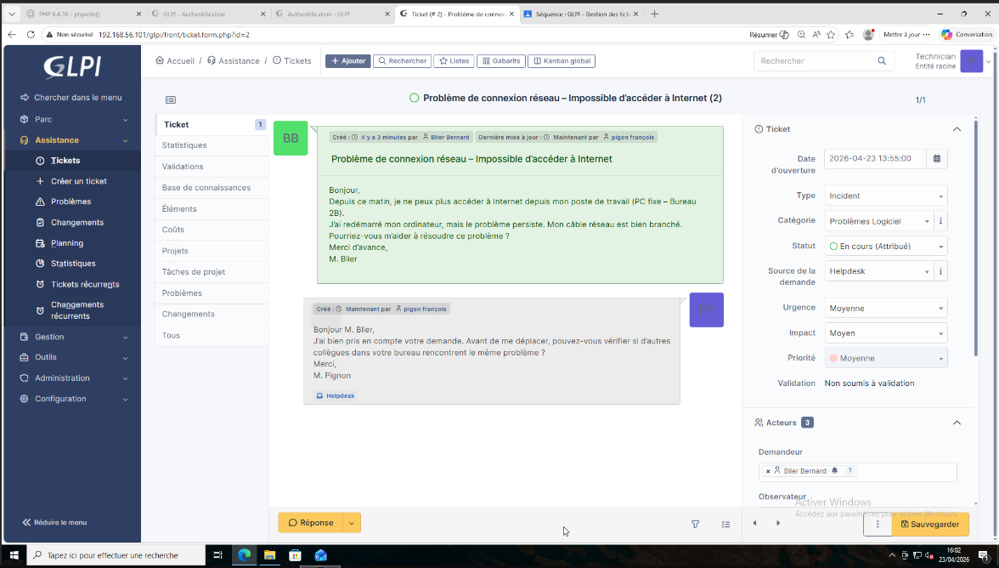

### 2. Diagnostic et Tests

[cite_start]Un diagnostic à distance est réalisé par le technicien, incluant la vérification des logs sur le serveur DHCP, un ping de l'adresse IP du poste, et la consultation de l'interface d'administration des équipements réseau[cite: 1].

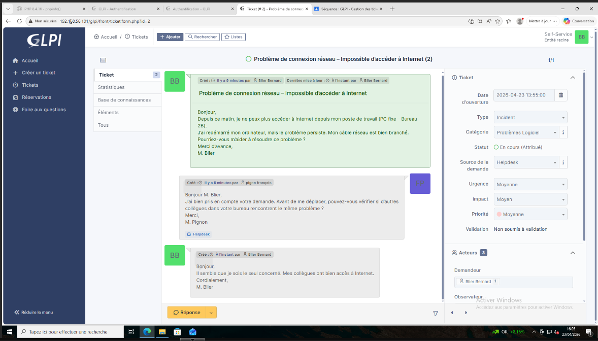

[cite_start]Il est constaté que le poste ne possède pas d'adresse IP valide[cite: 1].

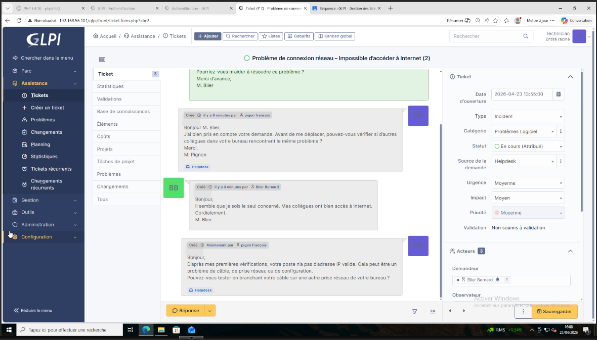

[cite_start]Il est demandé à l'utilisateur de tester la connexion sur une autre prise réseau de son bureau, mais M. Blier confirme que le problème persiste malgré ce changement[cite: 1].

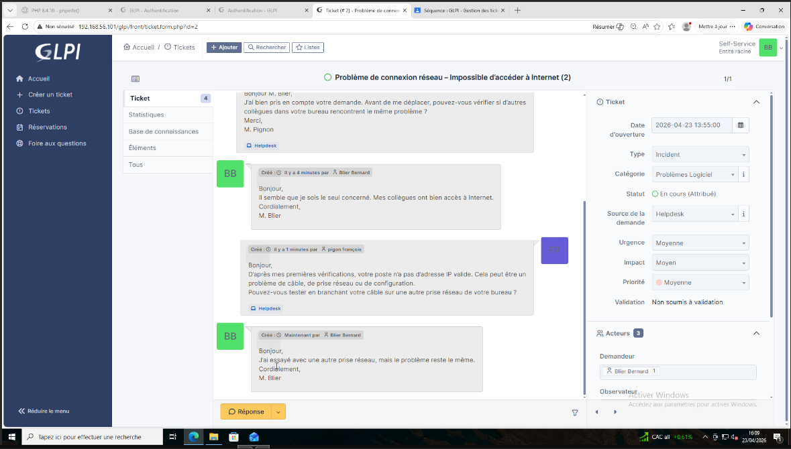

### 3. Intervention Physique et Résolution

[cite_start]M. Pignon se déplace physiquement et effectue des tests croisés : remplacement du câble réseau, test avec un autre PC sur la même prise (fonctionnel), et test du PC de l'utilisateur sur une autre prise (non fonctionnel)[cite: 1].

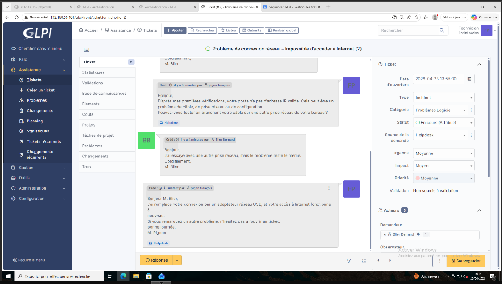

[cite_start]La carte réseau de l'ordinateur est diagnostiquée comme défectueuse[cite: 1]. [cite_start]Un adaptateur réseau USB est alors installé et configuré avec succès par le technicien[cite: 1].

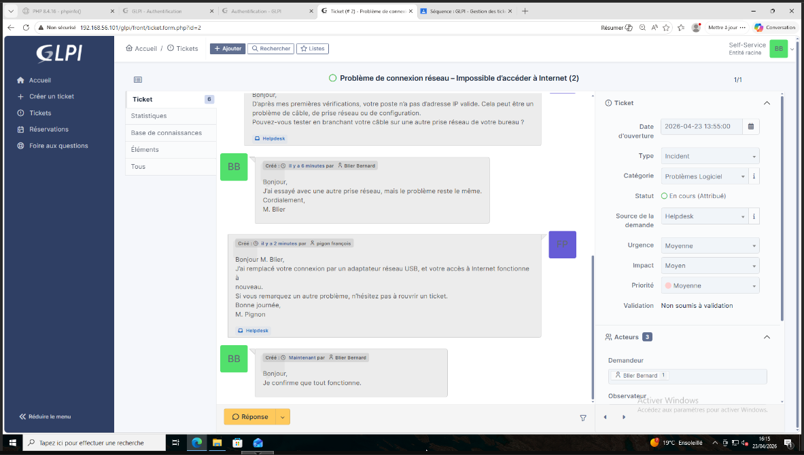

### 4. Clôture et Rapport d'intervention

[cite_start]Le technicien informe l'utilisateur du remplacement du matériel et de la restauration de son accès à Internet[cite: 1].

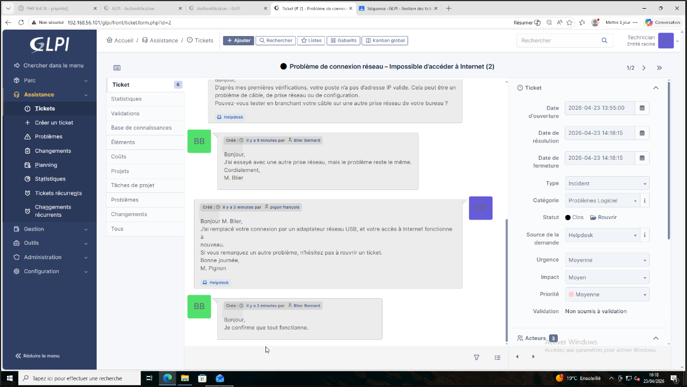

[cite_start]Après confirmation par l'utilisateur du bon fonctionnement, le ticket est clôturé avec un rapport d'intervention détaillant le problème initial (carte réseau défectueuse) et l'action corrective menée (ajout d'un adaptateur USB)[cite: 1].

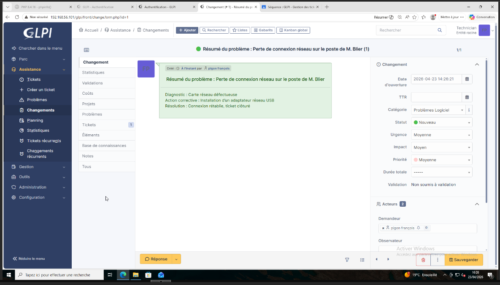

---

## Création de Tickets : Situation 2 (Incident de Sécurité)

!!! danger "Alerte de sécurité critique"
    [cite_start]Un ticket de priorité "Urgente" est ouvert par M. Blier, signalant des tentatives de connexion suspectes à son compte et l'envoi d'e-mails frauduleux depuis son adresse[cite: 2]. [cite_start]La catégorie ITIL est définie sur "Sécurité > Compte Compromis"[cite: 2].

### 1. Prise en charge immédiate

[cite_start]Le technicien (M. Pignon) s'assigne immédiatement le ticket en priorité absolue[cite: 2].

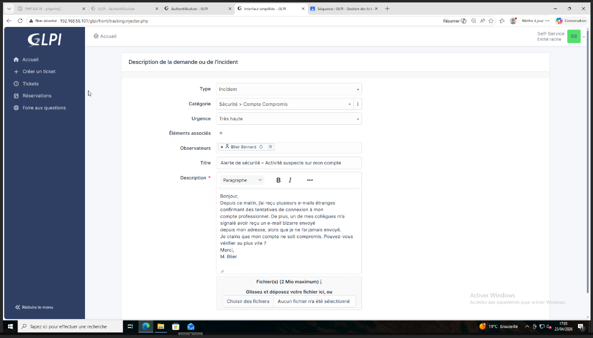

[cite_start]Il ordonne à l'utilisateur de cesser toute utilisation de son compte, l'interroge sur un éventuel clic sur un lien suspect, et procède immédiatement à la réinitialisation du mot de passe pour bloquer les accès frauduleux[cite: 2].

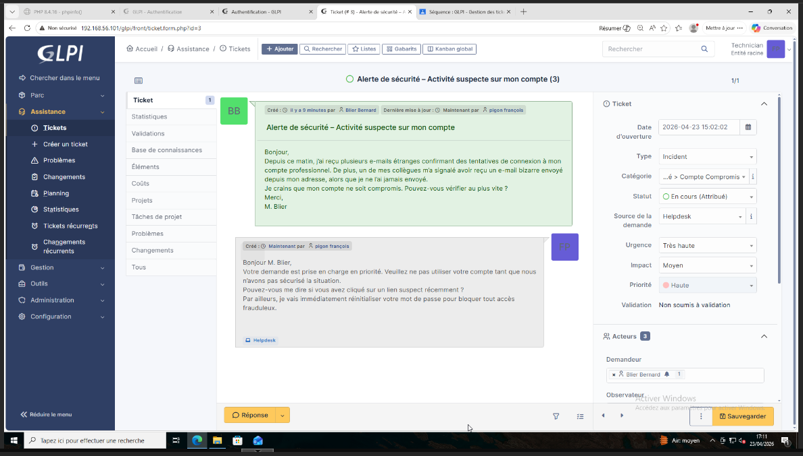

### 2. Analyse et Remédiation

[cite_start]M. Blier admet avoir ouvert une pièce jointe suspecte par curiosité la veille[cite: 2].

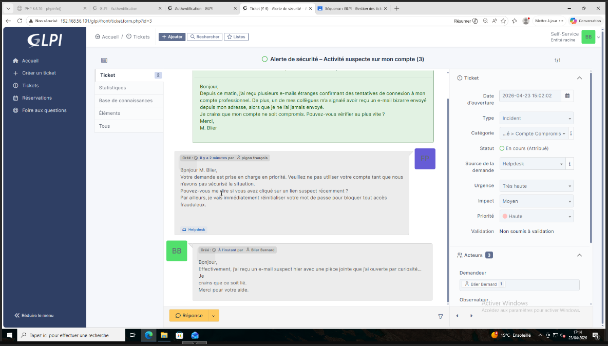

[cite_start]Plusieurs actions de sécurisation d'urgence sont lancées par le technicien[cite: 2]:

* [cite_start]Forçage de la déconnexion sur l'ensemble des appareils connectés[cite: 2].
* [cite_start]Analyse des logs de connexion du serveur pour isoler les accès suspects[cite: 2].
* [cite_start]Blocage de l'adresse IP suspecte au niveau du pare-feu[cite: 2].
* [cite_start]Lancement d'un scan complet de l'ordinateur de l'utilisateur avec l'outil antivirus[cite: 2].

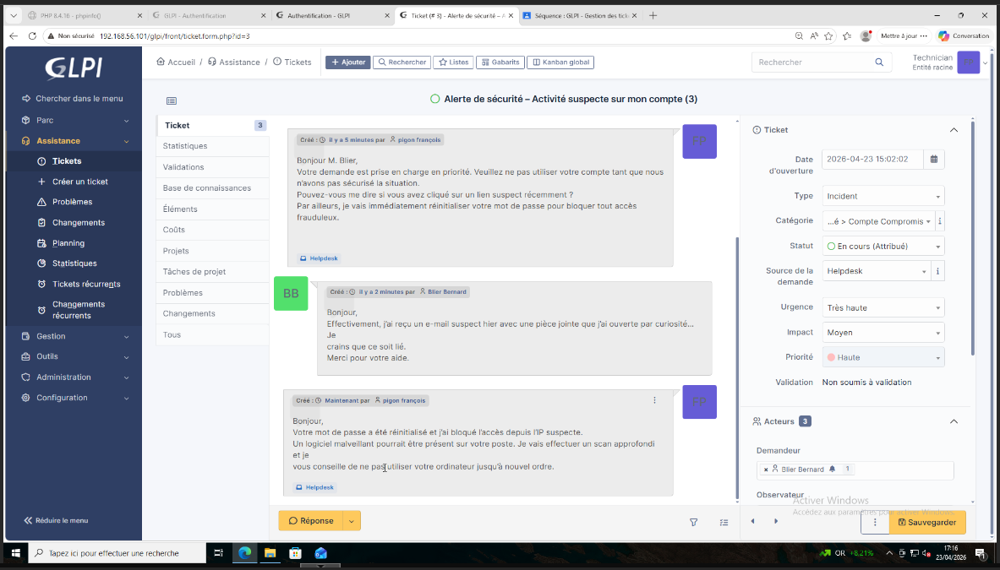

### 3. Nettoyage et Sécurisation renforcée

[cite_start]Le scan antivirus révèle la présence d'un cheval de Troie issu de la pièce jointe[cite: 2]. [cite_start]Le fichier malveillant est supprimé, le poste informatique est nettoyé, et l'ensemble des logiciels de sécurité sont mis à jour[cite: 2].

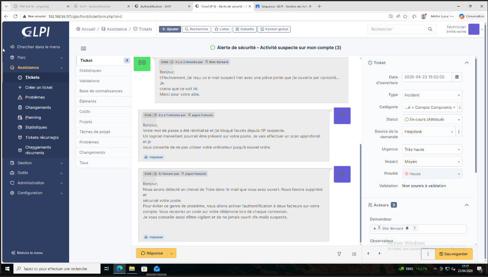

[cite_start]Pour prévenir toute future compromission, le technicien active l'authentification à deux facteurs (2FA) sur le compte de l'utilisateur[cite: 2].

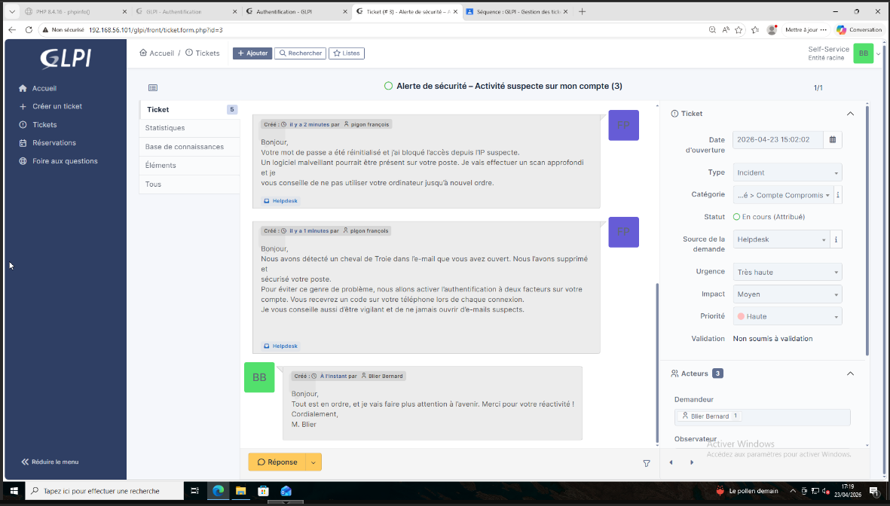

### 4. Clôture et Rapport d'intervention

[cite_start]Le technicien sensibilise M. Blier aux risques liés au phishing et aux bonnes pratiques de cybersécurité[cite: 2]. [cite_start]L'utilisateur confirme la restauration et le bon fonctionnement de ses accès sécurisés[cite: 2].

[cite_start]Le ticket est alors clôturé et un rapport complet d'incident est renseigné dans GLPI, détaillant le diagnostic de l'intrusion et les actions correctives appliquées (suppression du malware, ajout du 2FA)[cite: 2].

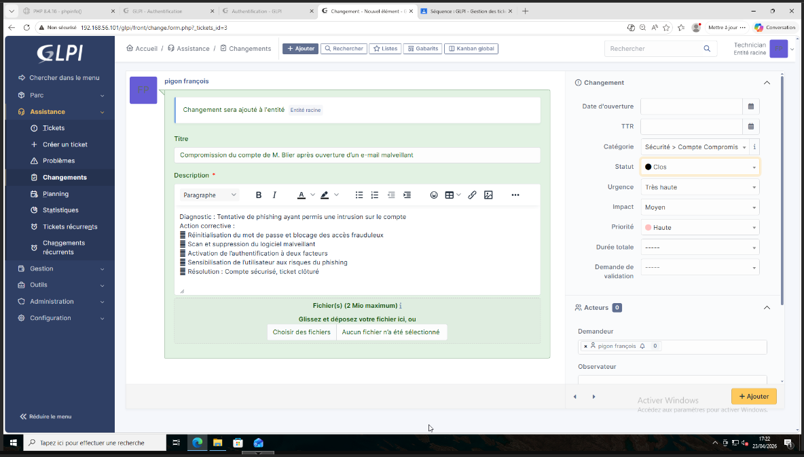