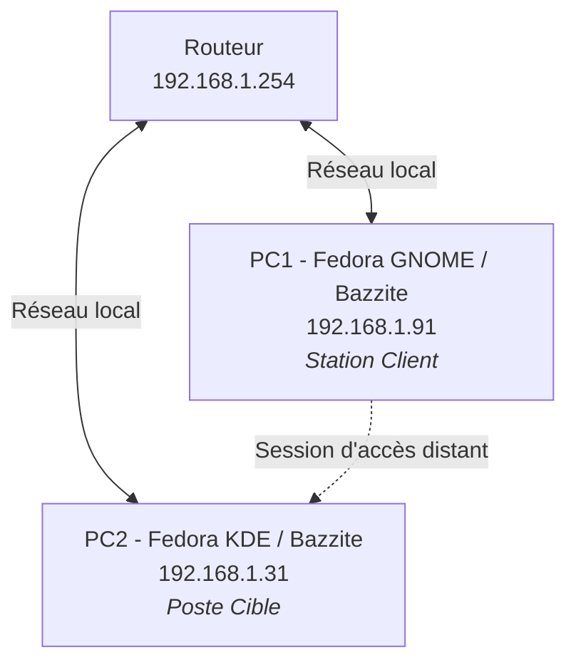
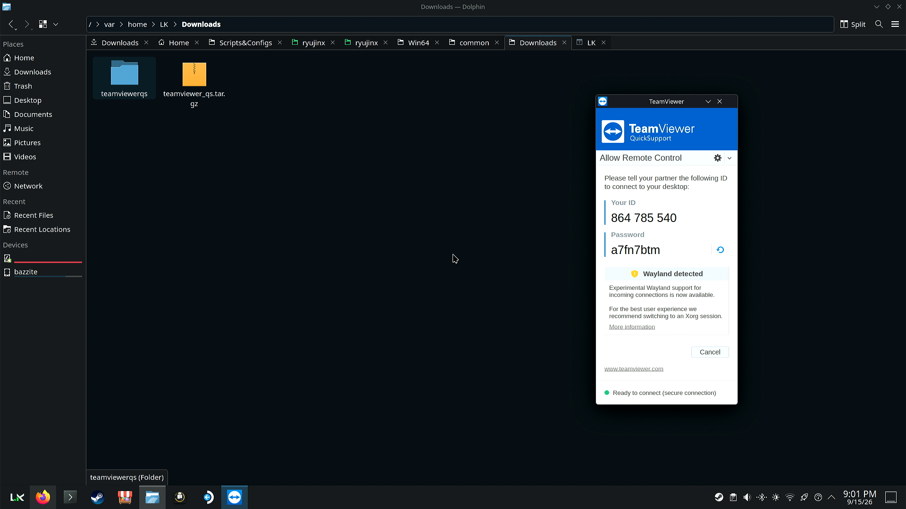
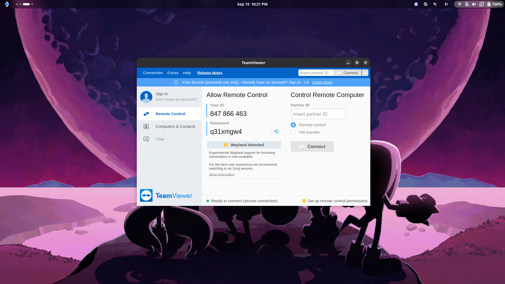
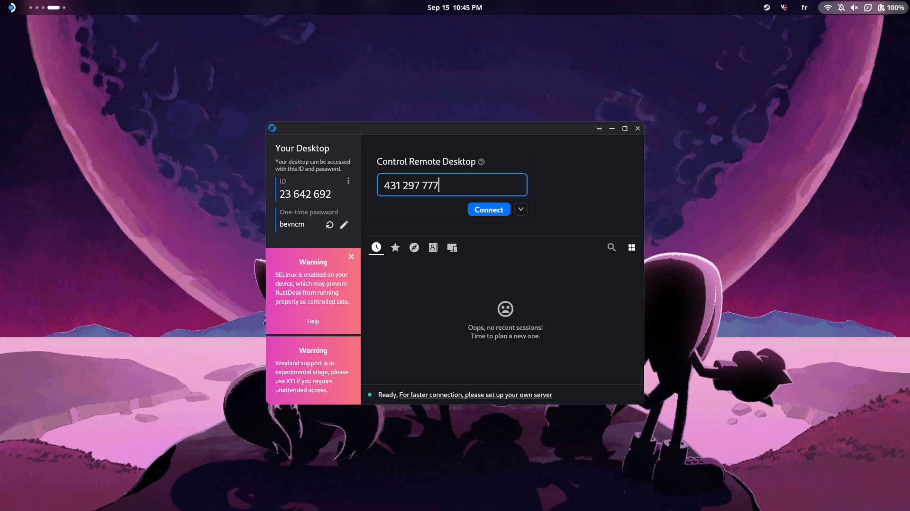
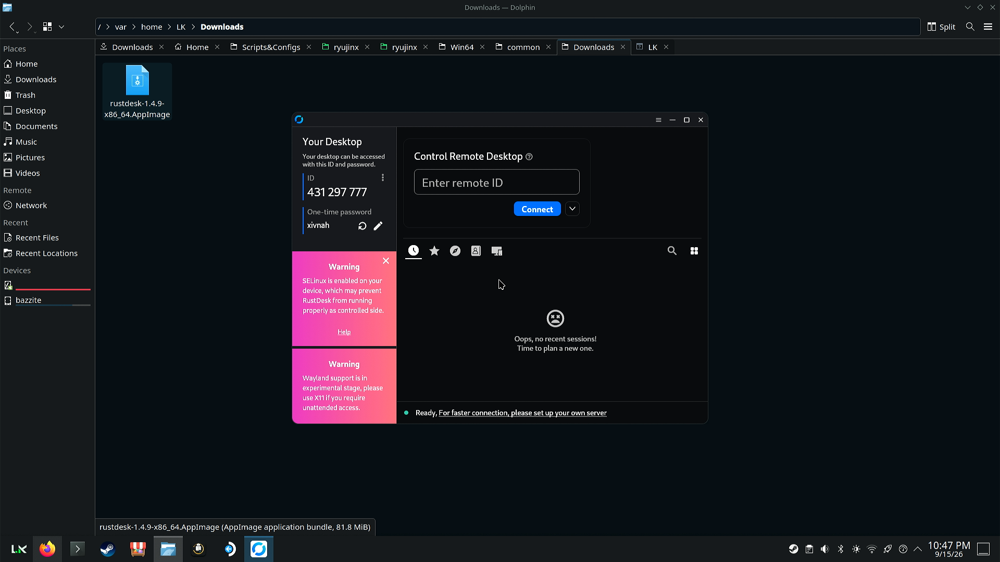

# Documentation : Accès à distance

**Auteur :** Loris.R  
**Module :** B2  
**Sujet :** Mettre en œuvre trois méthodes d'accès à distance sous Linux

---

!!! abstract "Notes"
    Ce guide présente l'installation, la configuration et le cas d'usage pratique de trois méthodes d'accès à distance aux philosophies distinctes : une solution propriétaire commerciale (**TeamViewer / QuickSupport**), une alternative open source légère (**RustDesk** au format AppImage) et un tandem haute performance initialement dédié au streaming (**Sunshine / Moonlight**).

---

## Topologie réseau

Pour l'ensemble des démonstrations présentées dans cette documentation, deux machines physiques sont déployées au sein d'un même sous-réseau local (`192.168.1.0/24`). Dans chaque scénario, le **PC1** agit comme la station de contrôle (client) et le **PC2** comme le poste administré à distance (serveur/cible).



---

## 1. TeamViewer & QuickSupport

!!! info "Différence entre TeamViewer complet et QuickSupport"
    * **TeamViewer (Client complet) :** logiciel lourd incluant le démon système (`teamviewerd`), la gestion de comptes centralisée, la prise en main entrante et sortante, ainsi que la gestion de carnet d'adresses.
    * **QuickSupport (Module d'assistance) :** application légère, portable et sans installation obligatoire. Elle est conçue exclusivement pour recevoir une assistance ponctuelle : elle génère un ID unique et un mot de passe temporaire dès son lancement sans altérer le système.

---

### A. Déploiement sur le poste cible (PC2)

Sur le **PC2 (Fedora KDE)**, la version légère **QuickSupport** a été récupérée sous forme d'archive compressée (`tar.gz`) directement depuis le site officiel de TeamViewer, puis extraite pour une exécution à la demande.

```bash
# Extraction de l'archive tarball
tar -xvf teamviewer_quicksupport.tar.gz

# Lancement de l'exécutable portable
./teamviewerqs/quicksupport
```



---

### B. Installation avancée sur la station client (PC1)

!!! warning "Contrainte d'architecture immuable (Bazzite / rpm-ostree)"
    Le **PC1** fonctionne sous **Bazzite** (système à image immuable basé sur Fedora Silverblue). Sur ce type de distribution, le répertoire système `/usr` est monté en lecture seule. On ne peut pas utiliser un gestionnaire classique comme `dnf`. L'installation de paquets natifs nécessite de superposer (*layering*) le paquet RPM dans l'image système via `rpm-ostree`, suivi d'un redémarrage.

#### Étape 1 : Téléchargement du paquet RPM officiel
Le paquet RPM 64 bits est récupéré dans l'espace temporaire du système :

```bash
curl -fL -o /tmp/teamviewer.rpm "[https://download.teamviewer.com/download/linux/teamviewer.x86_64.rpm](https://download.teamviewer.com/download/linux/teamviewer.x86_64.rpm)"
```

*Vérification :* s'assurer que le fichier téléchargé pèse environ 60 à 80 Mo via la commande `ls -lh /tmp/teamviewer.rpm`.

#### Étape 2 : Superposition du paquet via rpm-ostree
Le paquet est directement injecté dans l'arborescence immuable :

```bash
rpm-ostree install /tmp/teamviewer.rpm
```

*Effet :* `rpm-ostree` prépare une nouvelle image système fusionnée (*Changes queued for next boot*) qui sera chargée au prochain démarrage.

#### Étape 3 : Application du nouveau déploiement système
Redémarrage de la machine pour basculer sur la nouvelle image hôte contenant TeamViewer :

```bash
systemctl reboot
```

*Vérification :* après le boot, la commande `rpm-ostree status` doit afficher `teamviewer` dans la section `LayeredPackages`.

#### Étape 4 : Déclaration et activation du service systemd
Le démon de TeamViewer (`teamviewerd`) doit être exécuté en tâche de fond. Étant stocké dans `/opt/teamviewer/tv_bin/script/`, il convient de copier son unité dans le répertoire modifiable `/etc/systemd/system/` :

```bash
# 1. Copie du fichier de service systemd
sudo cp /opt/teamviewer/tv_bin/script/teamviewerd.service /etc/systemd/system/

# 2. Rechargement du gestionnaire de services
sudo systemctl daemon-reload

# 3. Activation et démarrage immédiat du démon
sudo systemctl enable --now teamviewerd.service
```

*Vérification :* la commande `systemctl status teamviewerd.service` doit retourner l'état `Active: active (running)`.

#### Étape 5 : Lancement et connexion

L'application est exécutée sur le **PC1** (via le terminal avec la commande `teamviewer` ou depuis le menu des applications) :



Une fois l'interface ouverte et le compte utilisateur connecté, il suffit de renseigner l'**ID partenaire** et le **mot de passe** fournis à l'écran par QuickSupport sur le PC2 pour initier le contrôle à distance.

---

### C. Démonstration vidéo : TeamViewer

<video width="100%" controls>
  <source src="../images/v1.mp4" type="video/mp4">
</video>

---

### D. Procédure de désinstallation / nettoyage (maintenance)

Pour retirer proprement la couche logicielle sur un système immuable :

```bash
# Arrêt et suppression du service démon
sudo systemctl disable --now teamviewerd.service
sudo rm -f /etc/systemd/system/teamviewerd.service
sudo systemctl daemon-reload

# Retrait de la couche logicielle de l'image immuable
rpm-ostree uninstall teamviewer

# Redémarrage pour appliquer le nettoyage
systemctl reboot
```

---

## 2. RustDesk (Solution open source portable)

### Mettre en œuvre RustDesk

Contrairement à la lourdeur de déploiement de TeamViewer, RustDesk est disponible sous forme d'**AppImage** (un format d'application que j'affectionne tout particulièrement) sur les deux postes en quelques clics :

1. Téléchargement du binaire `.AppImage` depuis le dépôt officiel GitHub de RustDesk.
2. Octroi des droits d'exécution : `chmod +x rustdesk-*.AppImage`.
3. Lancement direct par double-clic ou via le terminal.

!!! tip "L'intérêt du format AppImage sur un OS immuable"
    L'**AppImage** est un format d'encapsulation universel pour Linux. Il regroupe l'application et l'ensemble de ses dépendances dans un seul fichier binaire exécutable. Il ne nécessite **aucune installation**, aucun privilège d'administrateur (`root`), et n'altère en rien l'image système. C'est le format idéal pour une distribution atomique comme Bazzite.

#### Interface sur le client (PC1) :


#### Interface sur la cible (PC2) :


Il suffit ensuite de saisir l'identifiant du PC2 dans le champ « Autoroute » du PC1, puis de renseigner le mot de passe de session généré par RustDesk pour établir la connexion.

---

### Démonstration vidéo : RustDesk

<video width="100%" controls>
  <source src="../images/v2.mp4" type="video/mp4">
</video>

---

## 3. Sunshine & Moonlight (Accès haute performance / faible latence)

!!! info "Présentation et détournement de cas d'usage"
    * **Sunshine :** serveur hôte open source de flux vidéo/audio auto-hébergé (remplaçant l'ancien NVIDIA GameStream). Il s'installe sur la machine distante à contrôler (PC2).
    * **Moonlight :** client de réception ultra-léger et optimisé pour le décodage matériel. Il s'installe sur la machine de contrôle (PC1).

### Pourquoi utiliser cette solution en administration système ?

Bien que le couple Sunshine / Moonlight soit initialement conçu pour le streaming de jeux vidéo en réseau local, son architecture offre des avantages inédits pour l'administration à distance :

* **Latence quasi nulle :** enregistrement et encodage vidéo matériel direct (via GPU NVENC, VAAPI ou QuickSync) permettant un flux à 60 ou 120 FPS constant.
* **Fluidité d'affichage exceptionnelle :** supérieure aux protocoles classiques comme le VNC ou le RDP lors du traitement de tâches graphiques lourdes.
* **Sécurité :** appairage chiffré via un code PIN à quatre chiffres lors de la première poignée de main entre le client Moonlight et le serveur Sunshine.

Une fois l'appairage effectué, Moonlight permet d'afficher l'intégralité du bureau distant du PC2 avec une réactivité identique à celle d'un moniteur branché physiquement sur la machine.