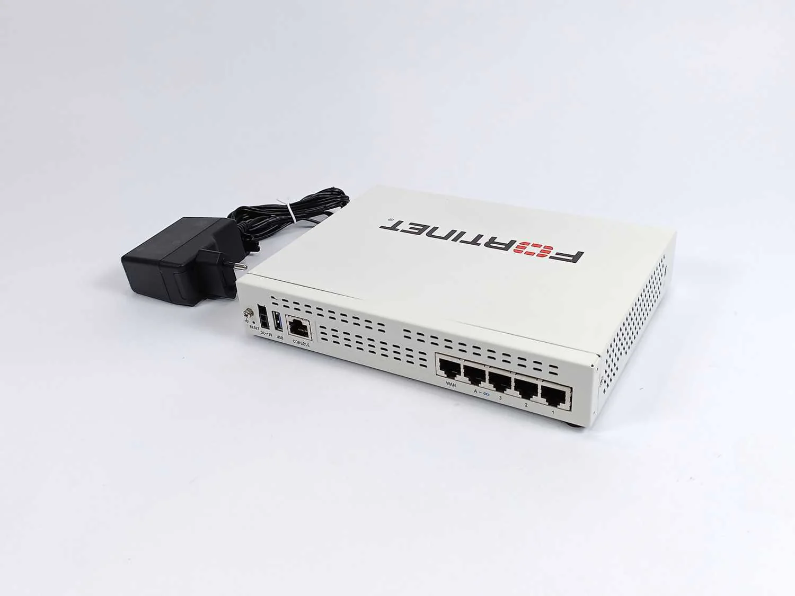
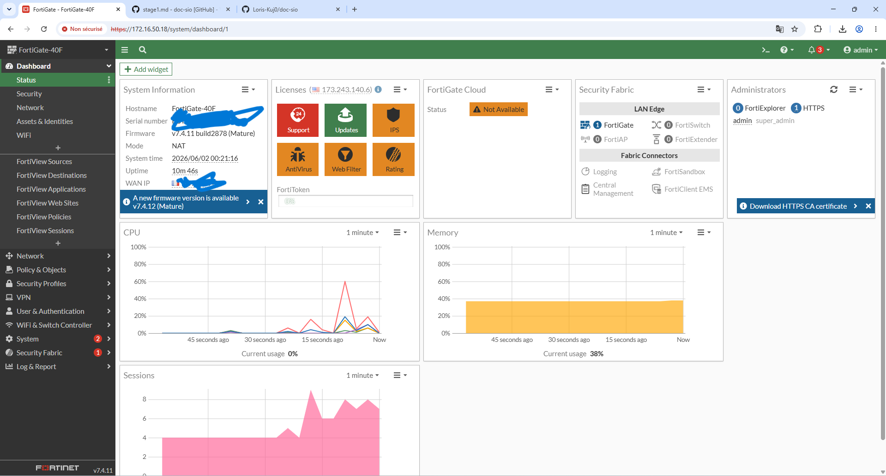
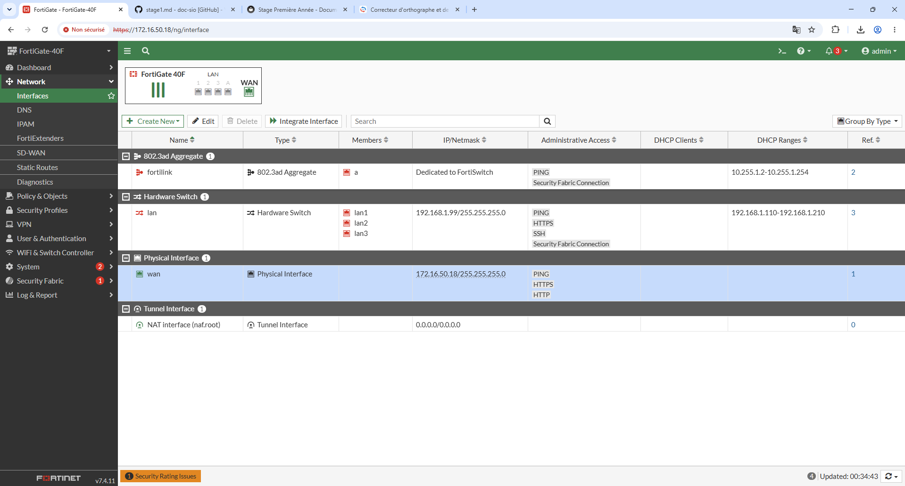
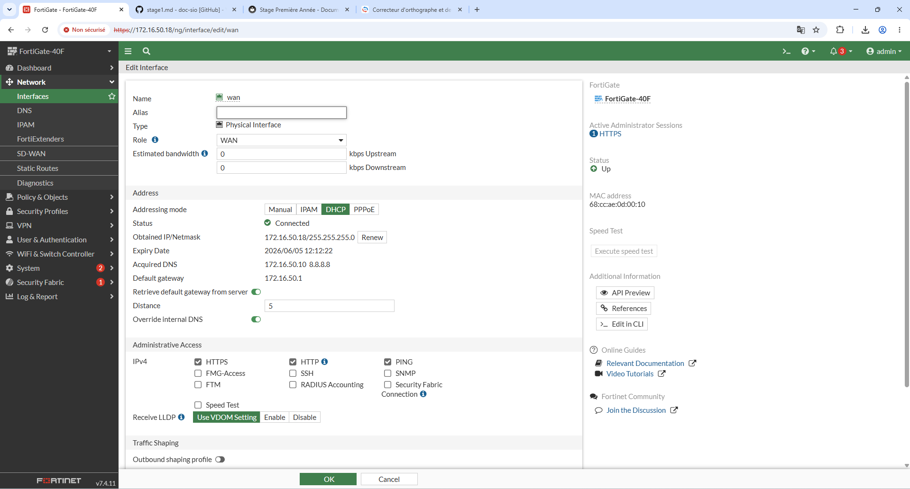
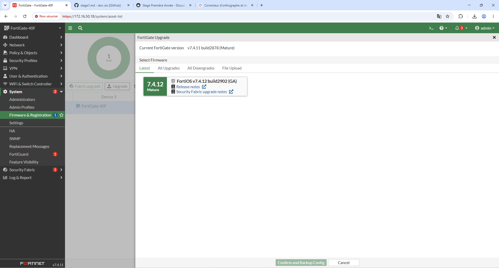
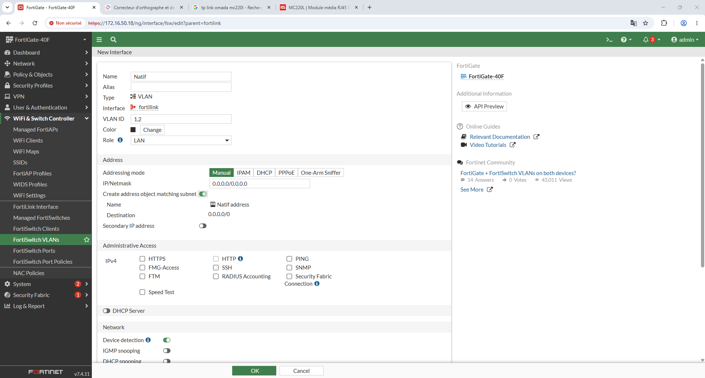

# Stage: Première année

**Auteur :** Loris.R   
**Module :** Stages  
**Sujet :** Stage de Première Année

---
# Outils Vus/utilisés 

## Datto: Logicielle RMM

Datto Remote Monitoring and Management (RMM) est une plateforme RMM sécurisée basée sur le cloud. Vous pouvez sécuriser, surveiller et gérer à distance les terminaux avec Datto RMM afin de réduire les coûts et d’améliorer l’efficacité du réseau.

## Passbolt: Gestionnaire de Mots de Passe

Passbolt est un gestionnaire de mots de passe collaboratif : chaque utilisateur dispose de son coffre-fort personnel, mais il est tout à fait possible de partager des identifiants entre plusieurs utilisateurs. Pour partager les mots de passe des clients par exemple.

# Taches

## Prises d'appels et Gestion de Tickets

## Configuration d'un switch FortiGate 40F

### Accès à l'interface

### Activation du mode HTTPS/HTTP

#### Interface>Interface Pysique>WAN

### Mise à jour du Switch

#### System>Firmware & Registration>Upgrade

### Configuration d'un VLAN

Création d'un VLAN "Natif"

---

